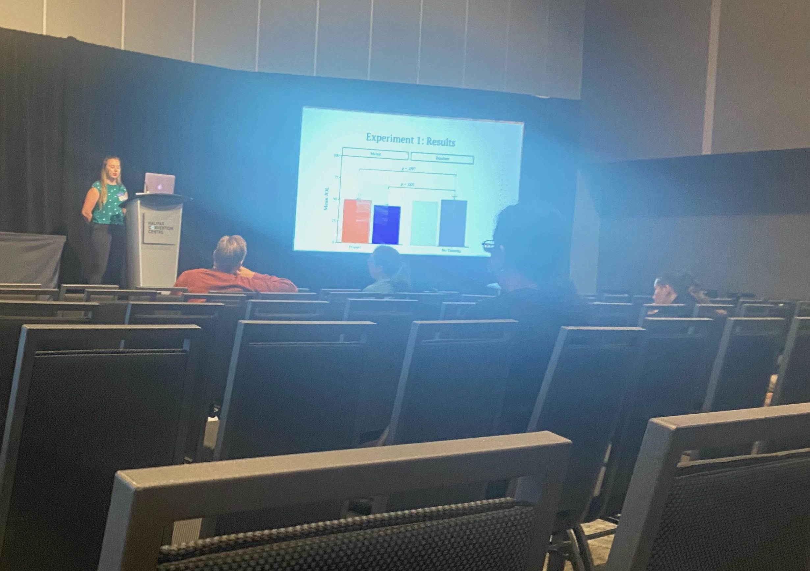
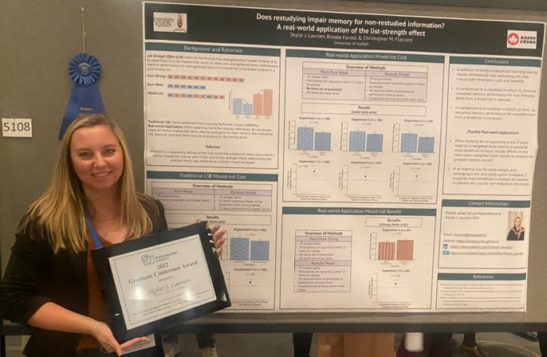
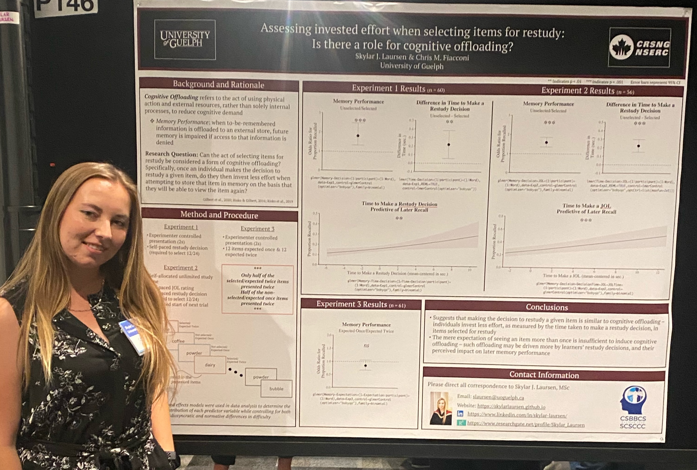

```{r setup, include=FALSE}
knitr::opts_chunk$set(echo = TRUE)
```

&nbsp;
&nbsp;
&nbsp;
&nbsp;

<center> <h1>**Invited Talks**</h1> </center>

**Laursen, S.J.** (2025). The triumphs and pitfalls of metacognitive control. *Western University: The Brain and Mind Coffee Talk Series*, London, ON.

**Laursen, S.J.** (2024). Examining adaptations in study time allocation and restudy selection as a function of expected test format. Southern Society for Philosophy and Psychology (SSPP), Cincinnati, OH.

<center> <h1>**Conference Talks**</h1> </center>

**Laursen, S.J.**, Fiacconi, C.M. (2025). Retrieval outcomes predict restudy decision efficacy. *Canadian Society for Brain, Behaviour and Cognitive Science (CSBBCS)*, Dundee, Scotland.

**Laursen, S.J.**, Fiacconi, C.M. (2024). Reactivity in metacognitive control: A novel demonstration of offloading. *Psychonomic Society Annual Meeting*, New York, NY.

**Laursen, S.J.**, Risko, E.F. (2024). Losing control of metacognitive control: Framing modulates the influence of list context on metamemory control decisions. *Canadian Society for Brain, Behaviour and Cognitive Science (CSBBCS)*, Edmonton, AB. *Best Talk Runner Up*

**Laursen, S.J.**, Fiacconi, C.M. (2024). Becoming fluent overnight: Long-lasting effects of percceptual fluency on metamemory judgments. *Canadian Society for Brain, Behaviour and Cognitive Science (CSBBCS)*, Edmonton, AB.

Salvatierra, J., **Laursen, S.J.**, & Risko, E.F. (2024). Phenomenological correlates of fluency. *Canadian Society for Brain Behaviour and Cognitive Science (CSBBCS)*, Edmonton, AB.

**Laursen, S.J.**, & Fiacconi, C.M. (2023). Metacognitive reactivity following restudy decisions: Does what you decide impact future memory? *Canadian Society for Brain Behaviour and Cognitive Science (CSBBCS)*, Guelph, ON.

Churey, K., **Laursen, S.J.**, Fiacconi, C. M. (2023). Judgment of learning (JOL) reactivity in order memory performance: A temporal bias analysis. *Canadian Society for Brain Behaviour and Cognitive Science (CSBBCS)*, Guelph, ON.

**Laursen, S.J.**, Wammes, J.D., Fiacconi, C.M. (2023). Examining the effect of expected test format and test difficulty on the frequency and mnemonic costs of mind wandering. *University of Guelph Neuroscience Day*, Guelph, ON.

**Laursen, S.J.**, & Fiacconi, C.M. (2023). Becoming fluent overnight: Long-lasting effects of perceptual fluency on metamemory judgments. *University of Guelph Interdisciplinary Psychology Graduate Symposium*, Guelph, ON.


&nbsp;  **Laursen, S.J.**, & Fiacconi, C.M. (2022). Probing the effect of perceptual (dis)fluency: It’s all relative. *Canadian Society for Brain Behaviour and Cognitive Science (CSBBCS)*, Halifax, NS. (pictured left)
&nbsp;  
&nbsp;  Churey, K.R., **Laursen, S.J.**, & Fiacconi, C.M. (2022). How does asking about memory change performance? Assessing the reactivity of metacognitive judgments through memory for order. *Canadian Society for Brain Behaviour and Cognitive Science (CSBBCS)*, Halifax, NS.

&nbsp;  DiMarco, D., **Laursen, S.J.**, Fiacconi, C.M. (2022). Is the errorful generation effect moderated by experimental design? *Canadian Society for Brain Behaviour and Cognitive Science (CSBBCS)*, Halifax, NS.

Fiacconi, C.M., **Laursen, S.J.** (2022). Probing the hidden costs of re-studying. *Canadian Society for Brain Behaviour and Cognitive Science (CSBBCS)*, Halifax, NS.


**Laursen, S.J.**, & Fiacconi, C.M. (2022). Does restudying entail a hidden cost for non-restudied information: A real-world application of the list strength effect. *Toronto Area Memory Group (TAMeG)*, Toronto, ON. (pictured right)

**Laursen, S.J.**, Powers, E., & Fiacconi, C.M. (2022). Investigating performance related cue dominance when predicting future memory. *University of Guelph Interdisciplinary Psychology Graduate Symposium*, Guelph, ON (virtual).

Churey, K., **Laursen, S.J.**, & Fiacconi, C.M. (2022). Metamemory and reactivity: Investigating the influence of metacognitive judgments on patterns of recall. *University of Guelph Interdisciplinary Psychology Graduate Symposium*, Guelph, ON (virtual).

DiMarco, D., **Laursen, S.J.**, & Fiacconi, C.M. (2022). Can we learn from our mistakes? Exploring errorful generation. *University of Guelph Interdisciplinary Psychology Graduate Symposium*, Guelph, ON (virtual).

**Laursen, S.J.** (2022). Overcoming the limitations of traditional inferential statistics using a linear mixed-effect modelling approach. *Hidden Methods Conference*, University of Alberta, AB (virtual).

**Laursen, S.J.**, & Fiacconi, C.M. (2021). Does restudying impair memory for non-restudied information. *Canadian Society for Brain Behaviour and Cognitive Science (CSBBCS)*, Montreal, QC. (virtual).

**Laursen, S.J.**, Wammes, J.D., & Fiacconi, C.M. (2021). Examining the influence of expected test format on the mnemonic impact and frequency of off-task thoughts/mind-wandering. *University of Guelph Neuroscience Day*, Guelph, ON. (virtual).

**Laursen, S.J.** (2021). ‘R’ you an artist?: A guide to visualizing data using R software (workshop). *University of Guelph Interdisciplinary Psychology Graduate Symposium*, Guelph, ON. (virtual).

**Laursen, S.J.**, Fiacconi, C.M. (2020). Does expected test format differentially affect how individuals monitor their learning? *University of Guelph Neuroscience Day*, Guelph, ON. (virtual).

**Laursen, S.J.**, Fiacconi, C.M. (2020). Contextual influences on the reciprocal relationship between monitoring and control strategies in self-regulated learning. *McMaster Conference on Education & Cognition*, Hamilton, ON. (virtual). [see talk here](https://www.youtube.com/watch?v=aiqCLXh_7VE)


<center> <h1>**Conference Posters**</h1> </center>

**Laursen, S.J.** & Fiacconi, C.M. (2025). Retrieval outcomes predict restudy decision efficacy. *Psychonomic Society Annual Meeting*, Denver, CO.

Golden, A., Faitakis, M., McLachlan, K., **Laursen, S.J.**, Ritter, C., Pei, J., Kennedy, K.E., Cook, J. (2025). Recommendations following clinical assessment for fetal alcohol spectrum disorder (FASD): Trends by age, sex, diagnostic status, and needs class. *Canada FASD Conference*, Toronto, ON.

**Laursen, S.J.**, Dollois, M.A., & Fiacconi, C.F. (2025). Using memory to model metamemory: A novel application of MINERVA 2. *Canadian Society for Brain Behaviour and Cognitive Science (CSBBCS)*, Dundee, Scotland.

**Laursen, S.J.**, & Fiacconi, C. M. (2024). Becoming fluent overnight: Long-lasting effects of perceptual fluency on metamemory judgments. *Psychonomic Society Annual Meeting*, New York, NY

**Laursen, S.J.** & Fiacconi, C. M. (2024). Decision-driven metacognitive reactivity: Does what you decide impact future memory. *Lake Ontario Visionary Establishment (L.O.V.E)*, Niagara Falls, ON.

**Laursen, S.J.**, Undorf, M., & Fiacconi, C.M. (2023). Performance-based cues dominate metamemory judgments. *Psychonomic Society Annual Meeting*, San Francisco, CA.
 
**Laursen, S.J.**, Sluka, D., & Fiacconi, C.M. (2023). Examining adaptations in study time allocation and restudy selection as a function of expected test format. *Canadian Society for Brain Behaviour and Cognitive Science (CSBBCS)*, Guelph, ON.


&nbsp;  
&nbsp; **Laursen, S.J.** & Fiacconi, C.M. (2023). Becoming fluent overnight. *Lake Ontario Visionary Establishment (L.O.V.E)*, Niagara Falls, ON. (pictured left)

&nbsp; Powers, E., **Laursen, S.J.**, Undorf, M., & Fiacconi, C.M. (2023). Influence of performance-related cues on metacognitive judgments. *Lake Ontario Visionary Establishment (L.O.V.E)*, Niagara Falls, ON.
 
&nbsp; Kazatchkova, A., **Laursen, S.J**., Fiacconi, C.M. (2023). Becoming famous through distraction: Mind wandering and the false fame effect. *Lake Ontario Visionary Establishment (L.O.V.E)*, Niagara Falls, ON.

&nbsp; 

Churey, K.R., **Laursen, S.J.**, Pun,J., Fiacconi, C.M. (2023). Examining the influence of metacognitive judgments on recall dynamics. *Lake Ontario Visionary Establishment (L.O.V.E)*, Niagara Falls, ON.


&nbsp;  
**Laursen, S.J.**, Farrell, B., & Fiacconi, C.M. (2022). Does restudying impair memory for non-restudied information? A real world application of the list strength effect. *Psychonomic Society Annual Meeting*, Boston, MA. *Graduate Coference Award* (pictured right) [see poster here](PSYC2022_poster.pdf)



&nbsp;&nbsp;&nbsp;&nbsp;&nbsp;      
&nbsp;&nbsp;&nbsp;&nbsp;&nbsp;    
&nbsp;&nbsp;&nbsp;&nbsp;&nbsp;      
&nbsp;&nbsp;&nbsp;&nbsp;&nbsp;      
&nbsp;&nbsp;&nbsp;&nbsp;&nbsp;  
&nbsp;&nbsp;&nbsp;&nbsp;&nbsp;  
&nbsp;    
**Laursen, S.J**., & Fiacconi, C.M. (2022). Assessing the effort invested when selecting items for restudy: Is there a role for cognitive offloading? *Canadian Society for Brain Behaviour and Cognitive Science (CSBBCS)*, Halifax, NS. (pictured left)

&nbsp;**Laursen, S. J.**, Wammes, J.D., & Fiacconi, C.M. (2022). Examining the tendency to mind wander when preparing for different test formats and how this impacts future memory performance. *University of Guelph Neuroscience Day*, Guelph, ON. [see poster here](Neuro2022_poster.pdf) 

&nbsp;**Laursen, S.J.**, Wammes, J.D., & Fiacconi, C.M. (2021). Examining the mnemonic impact and frequency of off-task thoughts/mind-wandering as a function of expected test format. *Psychonomic Society Annual Meeting*, New Orleans, LA. (virtual).

**Laursen, S.J.**, & Fiacconi, C.M. (2021). Is there a hidden cost to restudy? *McMaster Conference on Education & Cognition*, Hamilton, ON. (virtual).

**Laursen, S.J.**, & Fiacconi, C.M. (2021). Context-dependent use of the memorizing effort heuristic. *Canadian Society for Brain Behaviour and Cognitive Science (CSBBCS)*, Montreal, QC. (virtual). [see poster here](BBCS2020_poster.pdf)

Sluka, D., **Laursen, S.J.**, & Fiacconi, C.M. (2021). Are individuals’ re-study decisions sensitive to test format? *Canadian Society for Brain Behaviour and Cognitive Science (CSBBCS)*, Montreal, QC. (virtual).

**Laursen, S.J.**, Wammes, J.D., & Fiacconi, C.M. (2021). Does expected test format affect the mnemonic impact of off-task thought? *University of Guelph Neuroscience Day*, Guelph, ON. (virtual). *Best Poster Honourable Mention*

**Laursen, S.J.**, Fiacconi, C.M. (2020). Contextual influences on monitoring and control strategies in self-regulated learning. *Psychonomic Society Annual Meeting*, Austin, TX. (virtual). [see poster slides here](PSYC2020_poster.mp4)

**Laursen, S.J.**, & Fiacconi, C.M. (2020). Does test experience change how we monitor our learning? *University of Guelph Neuroscience Day*, Guelph, ON. (virtual).

 
**Laursen, S.J.**, Manning, S., & Fiacconi, C.M. (2020). Contextual influences on memory predictions and study time allocation. *Lake Ontario Visionary Establishment (L.O.V.E)*, Niagara Falls, ON. (pictured right) [see poster here](LOVE2020_poster.pdf)

 

&nbsp;  
&nbsp;  
&nbsp;  
&nbsp;  
&nbsp;  
&nbsp;  
&nbsp;  **Laursen, S.J.**, Mitton, E.E., Skinner, J., & Fiacconi, C.M. (2019). How and when does perceptual fluency impact predictions of future memory performance? *Psychonomic Society Annual Meeting* Montreal, QC. (pictured left) [see poster here](PSYC2019_poster.pdf)


 

**Laursen, S.J.**, Mitton, E.E., Skinner, J., & Fiacconi, C.M. (2019). Challenges in measuring the influence of  &nbsp;  perceptual fluency on judgments of learning (JOLs). *Canadian Society for Brain, Behaviour and Cognitive Science (CSBBCS)*, Waterloo, ON. (pictured right) [see poster here](BBCS2019_poster.pdf)

**Laursen, S.J.**, & Fiacconi, C.M. (2019). When does perceptual fluency impact predictions of future memory performance? *University of Guelph Honours Thesis Poster Conference*, Guelph, ON. [see poster here](Honours_poster.pdf)


&nbsp;  
&nbsp;  
&nbsp;  
&nbsp;  **Laursen, S.**, Mitton, E., & Fiacconi, C.M. (2019). Is there a role for perceptual fluency for judgments of learning (JOLs)? *Lake Ontario Visionary Establishment (L.O.V.E)*, Niagara Falls, ON. (pictured left) [see poster here](LOVE2019_Poster.pdf)

&nbsp;  Mitton, E., **Laursen, S.**, & Fiacconi, C. M. (2018). Task context moderates the influence of perceptual fluency on judgments of learning (JOLs): A role for cue saliency. *Psychonomic Society Annual Meeting*, New Orleans, LA. 
