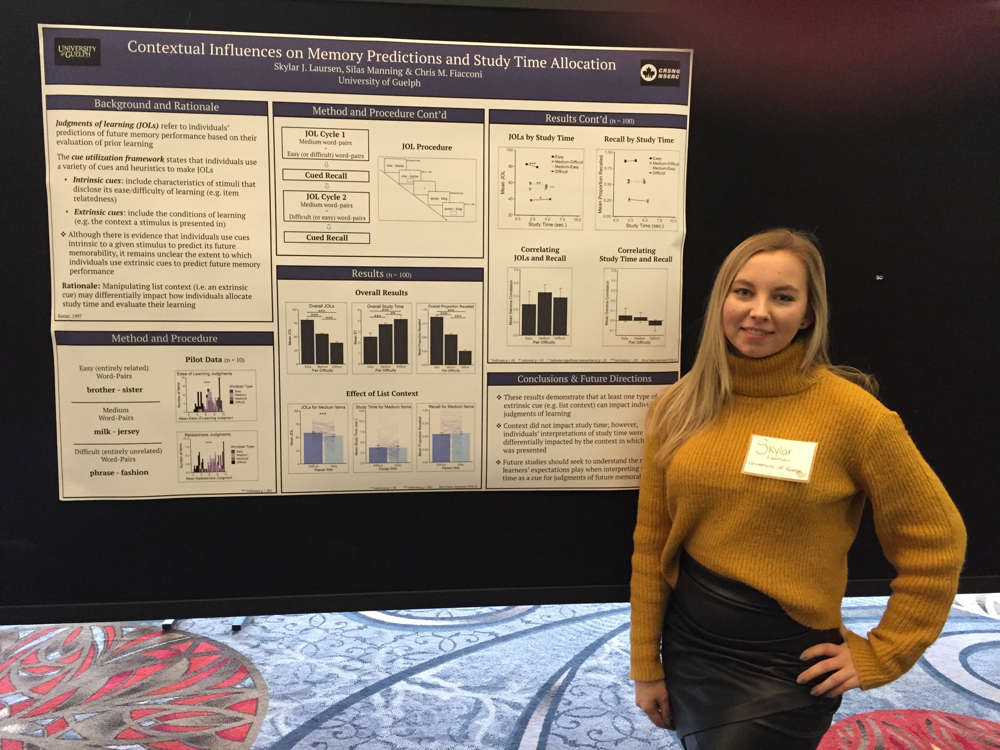

```{r setup, include=FALSE}
knitr::opts_chunk$set(echo = TRUE)
```

<center> <h1>**Conference Talks**</h1> </center>

**Laursen, S.J.**, & Fiacconi, C.M. (2021). Does restudying impair memory for non-restudied information. Canadian Society for Brain Behaviour and Cognitive Science (CSBBCS), Jun. 2021, Montreal, QC. (virtual).

**Laursen, S.J.**, Wammes, J.D., & Fiacconi, C.M. (2021). Examining the influence of expected test format on the mnemonic impact and frequency of off-task thoughts/mind-wandering. University of Guelph Neuroscience Day, May. 2021, Guelph, ON. (virtual).

**Laursen, S.J.** (2021). ‘R’ you an artist?: A guide to visualizing data using R software (workshop). University of Guelph Interdisciplinary Psychology Graduate Symposium, Apr. 2021, Guelph, ON. (virtual).

**Laursen, S.J.**, Fiacconi, C.M. (2020). Does expected test format differentially affect how individuals monitor their learning? University of Guelph Neuroscience Day, Jul. 2020, Guelph, ON. (virtual).

**Laursen, S.J.**, Fiacconi, C.M. (2020). Contextual influences on the reciprocal relationship between monitoring and control strategies in self-regulated learning. McMaster Conference on Education & Cognition, Jul. 2020, Hamilton, ON. (virtual). [see talk here](https://www.youtube.com/watch?v=aiqCLXh_7VE)


<center> <h1>**Conference Posters**</h1> </center>

**Laursen, S.J.**, Wammes, J.D., & Fiacconi, C.M. (Accepted 2021). Examining the mnemonic impact and frequency of off-task thoughts/mind-wandering as a function of expected test format. Psychonomic Society Annual Meeting, New Orleans, LA. (virtual).

**Laursen, S.J.**, & Fiacconi, C.M. (2021). Is there a hidden cost to restudy? McMaster Conference on Education & Cognition, Jul. 2021, Hamilton, ON. (virtual).

**Laursen, S.J.**, & Fiacconi, C.M. (2021). Context-dependent use of the memorizing effort heuristic. Canadian Society for Brain Behaviour and Cognitive Science (CSBBCS), Montreal, QC. (virtual). [see poster here](BBCS2020_poster.pdf)

Sluka, D., **Laursen, S.J.**, & Fiacconi, C.M. (2021). Are individuals’ re-study decisions sensitive to test format? Canadian Society for Brain Behaviour and Cognitive Science (CSBBCS), Jun. 2021, Montreal, QC. (virtual).

**Laursen, S.J.**, Wammes, J.D., & Fiacconi, C.M. (2021). Does expected test format affect the mnemonic impact of off-task thought? University of Guelph Neuroscience Day, May. 2021, Guelph, ON. (virtual). *Best Poster Honourable Mention*

**Laursen, S.J.**, Fiacconi, C.M. (2020). Contextual influences on monitoring and control strategies in self-regulated learning. Psychonomic Society Annual Meeting, Nov. 2020, Austin, TX. (virtual). [see poster slides here](PSYC2020_poster.mp4)

**Laursen, S.J.**, & Fiacconi, C.M. (2020). Does test experience change how we monitor our learning? University of Guelph Neuroscience Day, Jul. 2020, Guelph, ON. (virtual).

 
&nbsp;  
**Laursen, S.J.**, Manning, S., & Fiacconi, C.M. (2020). Contextual influences on memory predictions and study time allocation. Lake Ontario Visionary Establishment (L.O.V.E), Feb. 2020, Niagara Falls, ON. [see poster here](LOVE2020_poster.pdf)

 

&nbsp;  
&nbsp;  
&nbsp;  
&nbsp;  
&nbsp;  
&nbsp;  
&nbsp;  **Laursen, S.J.**, Mitton, E.E., Skinner, J., & Fiacconi, C.M. (2019). How and when does perceptual fluency impact predictions of future memory performance? Psychonomic Society Annual Meeting, Nov. 2019, Montreal, QC. [see poster here](PSYC2019_poster.pdf)


 
&nbsp;  

**Laursen, S.J.**, Mitton, E.E., Skinner, J., & Fiacconi, C.M. (2019). Challenges in measuring the influence of  &nbsp;  perceptual fluency on judgments of learning (JOLs). Canadian Society for Brain, Behaviour and Cognitive Science (CSBBCS), Jun. 2019, Waterloo, ON. [see poster here](BBCS2019_poster.pdf)

**Laursen, S.J.**, & Fiacconi, C.M. (2019). When does perceptual fluency impact predictions of future memory performance? University of Guelph Honours Thesis Poster Conference, Apr. 2019, Guelph, ON. [see poster here](Honours_poster.pdf)


&nbsp;  
&nbsp;  
&nbsp;  
&nbsp;  **Laursen, S.**, Mitton, E., & Fiacconi, C.M. (2019). Is there a role for perceptual fluency for judgments of learning (JOLs)? Lake Ontario Visionary Establishment (L.O.V.E), Feb. 2019, Niagara Falls, ON. [see poster here](LOVE2019_Poster.pdf)

&nbsp;  Mitton, E., **Laursen, S.**, & Fiacconi, C. M. (2018). Task context moderates the influence of perceptual fluency on judgments of learning (JOLs): A role for cue saliency. Psychonomic Society Annual Meeting, Nov. 2018, New Orleans, LA. 
